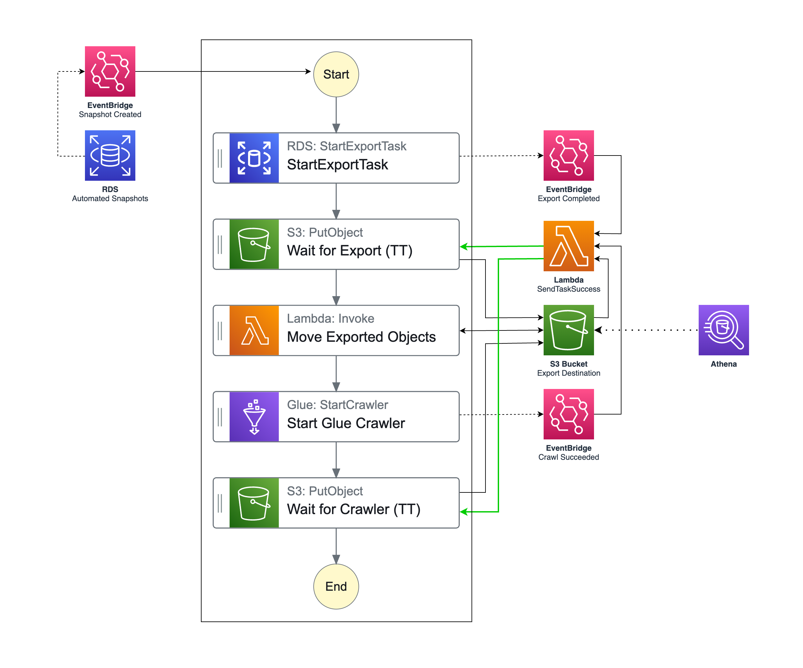

# Step Functions - Export RDS snapshot to Athena

This project is a sample project to demonstrate how to automatically export RDS snapshot to Athena using Step Functions and EventBridge.

Features some useful real world use cases:

-   Use Step Functions to orchestrate the whole process
-   Use Step Functions Callback Pattern - waitForTaskToken and sendTaskSuccess to pause the workflow and wait for the task to be completed
-   Use EventBridge Rules to trigger actions when various events happen

## Architecture

